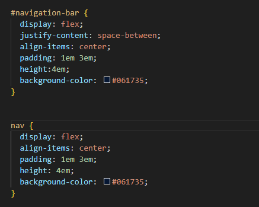
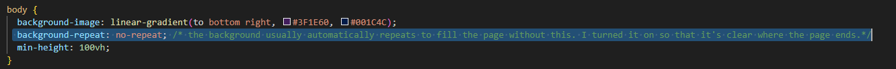

# ntam4217-tracker
## <u><b>Context</b></u>
My Web App “WatchBox” is a tracking app for TV shows and Movies. It’s designed to help movie and TV show enthusiasts keep track of their content, and can be used to sort their current, past and future watching preferences. It serves as a digital diary for their viewing entertainment, allowing for users to maintain a record of their favourite movies and tv shows, ratings, descriptions, reviews, genres, watched and to watch. It’s suitable for all kinds of shows and movies, as well as people of all ages, due to it’s simplistic and user-centered design. “Watchbox” aims to help users seamlessly log and track their watch habits.

## Initial development
Firstly, I made the navigation bar, making sure the styles were all correct and the add content button was where I liked it. I utilised flex box to and justify-content: space-between; to make sure that they were symmetrically balanced. I used a CSS reset by Eric Meyer to reset default browser css styles and provide consistency across different browsers. I also added a language attribute for screen reader accessibility.

# Things I learnt through this project
## ID's can be useful!
It sounds pretty obvious doesn't it?

As seen below, I tried to get into the habit of always using either an ID or a class, depending on whether the object was unique or not, factoring potential future development. This was something I didn't do in previous units; sometimes I would only use classes because it felt easier to only rely on one method, but it's much easier looking through the css when items are categorised correctly!

However, this change did confuse me initially, because I kept changing the css properties of the logo, but it wouldn't change because I used the wrong selector... 

## Dead code is not good!

I used to think that some dead code is good to leave in case things change in the future. THIS IS NOT THE CASE. If I've already made the background 100% of the viewport height, there's no use having background no repeat in the css code. That css can come if I need to scroll lower than the background height, which I will not need to do so in this project. Hence, remove it unless you know you will use it in the future. Otherwise you will definitely forget about it down the line.

I used to think that some dead code is good to leave in case things change in the future. THIS IS NOT THE CASE. 

## Github is weirdly confusing yet simple
It's great that VS code's git Source Panel makes it much easier to understand, and after you use it for a while you start understanding how to push and commit using the terminal as well.

I was also quite scared to commit changes, because I wanted to make sure everything was perfect and there were no embarrassing mistakes before I committed. But as I committed my initial progress of the nav bar and updated small things that I have overlooked and committed and pushed those again, I realise that there's really nothing to be ashamed about; the point of committing is to show yourself and others the progress you have made, big or small. In fact if you don't update it enough you miss all the small changes you made to perfect it, all the testing and small adjustments in css and flexbox to make it align perfectly, and again, thats the whole point of a repository. 

## Kebab Case!
I didn't know what it was called before. All I knew from previous projects was that camelCase was easy to write, but difficult for me personally to read and debug. I actually thought kebab-case was the same as snake_case, but a kebab is much easier on my pinkies.

## Sources:
http://meyerweb.com/eric/tools/css/reset/
 https://www.w3schools.com/tags/att_lang.asp
 https://medium.com/@madhum86/css-font-sizing-pixels-vs-em-vs-rem-vs-percent-vs-viewport-units-b1485716afe7

