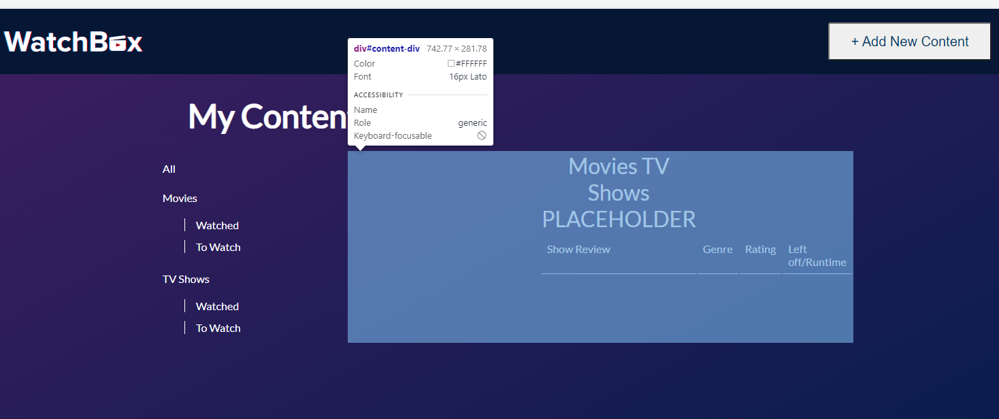

# ntam4217-tracker
## <u><b>Context</b></u>
My Web App “WatchBox” is a tracking app for TV shows and Movies. It’s designed to help movie and TV show enthusiasts keep track of their content, and can be used to sort their current, past and future watching preferences. It serves as a digital diary for their viewing entertainment, allowing for users to maintain a record of their favourite movies and tv shows, ratings, descriptions, reviews, genres, watched and to watch. It’s suitable for all kinds of shows and movies, as well as people of all ages, due to it’s simplistic and user-centered design. “Watchbox” aims to help users seamlessly log and track their watch habits.

## <u>Things to note</u>
Parcel is installed for future versions, but please run this current version on Node.js

## <u>HTML & CSS Stages</u>
## Initial Development
Firstly, I made the navigation bar, making sure the styles were all correct and the add content button was where I liked it. I utilised flex box to and justify-content: space-between; to make sure that they were symmetrically balanced. I used a CSS reset by Eric Meyer to reset default browser css styles and provide consistency across different browsers. I also added a language attribute for screen reader accessibility.

## Filter Development
I had a little bit of trouble making the filters stay exactly where I wanted to on the page. I was initially going to use CSS selectors to make the watched and to watch sections indent from the rest of the list, but making a subfilter option class seemed to make more sense since there were 4 items that needed to be indented. Furthermore, I didn't know how to make the left side have a line going down it, but this <a href="https://stackoverflow.com/questions/25584359/creating-a-vertical-line-next-to-a-list-item">source</a> solved it really easily by creating a solid line on the left border and a div that encapsulates both objects so that the solid line on the left of the items would be one seamless line like shown in my finalised design.

After some revision, I realised that changing the margin of the "My Content" header made more sense than using li:first-child.

## Table Development
I made the table with the relevant headings, but soon realised that because the filter div was written above and not related to the table, it would display above the table itself. Thus, I needed to either use a CSS Grid or wrap both elements in a section and use flexbox or float to put them side by side. However, the grid was still looking a bit weird. After using Googles' developer tool to see why it looked so weird, I realised it was because I wrapped the table in the scrollable div. So then I fixed it by making the table width 100% instead of 60%, as it was changing it to 60% of the parent div, not the vw. 

I then made a custom scrollbar with the help of <a href="https://www.w3schools.com/howto/howto_css_custom_scrollbar.asp>">W3 Schools</a>.

However, I ran into some problems when making the table. I realised that for the website to feature the design I wanted it to feature, making each row into individual sections would be better, although more tedious. This was because of the way tables work, I would be unable to customize the gap between rows, and would have to find and test different workarounds to make each row have an individual border radius. For me, making separate divs made more sense, as the CSS for tables and HTML also gets too messy for my liking. BUT... Tables are more <a href="https://stackoverflow.com/questions/2617895/actual-table-vs-div-table">semantically correct</a> for tabular data. So, I decided to push through and tried to learn more about tables, since it'll only benefit me in the future to become more familiar and prevent me from div souping.

## Pop Up Development

I initially wanted to remove the outline of the add new content button, but after reading a few articles on <a href="https://www.a11yproject.com/posts/never-remove-css-outlines/">how important the outline and in particular an outline when a button is focused on is</a>, I decided not to, and to change the outline to white, as well as provide an underline when focused to help accessibility. 
https://www.youtube.com/watch?v=MBaw_6cPmAw

I originally wanted to use CSS Grid, but felt more confident in my ability to use flexbox to style it the way I liked. Regardless, it was a similar layout to css grid, with the divs separating each row. In the future, I would probably use CSS grid because it takes up less space in the code, but for something small like this, I think it's legible.

There was also an issue with the genre select. If I allowed for multiple select, it would appear as a scrollable list, and not a dropdown, as dropdown menus only allow for one option, something I had not anticipated when making my design. Thus, I decided to go with the scrollable list as only one genre select would make the web app less functional.
## Left off vs Length

The original idea for TV shows was for the tracker to show the user which season/episode they are on. However, it didn't make much sense for it to track which episode viewers are on when apps like Netflix and DisneyPlus already save that data, and the entered data is unable to be edited, only viewed back. Hence, I changed the left off label to show the length of the show instead.

# Things I learnt through this project
## ID's can be useful!
It sounds pretty obvious doesn't it?

As seen below, I tried to get into the habit of always using either an ID or a class, depending on whether the object was unique or not, factoring potential future development. This was something I didn't do in previous units; sometimes I would only use classes because it felt easier to only rely on one method, but it's much easier looking through the css when items are categorised correctly!

However, this change did confuse me initially, because I kept changing the css properties of the logo, but it wouldn't change because I used the wrong selector... 

## Dead code is not good!

I used to think that some dead code is good to leave in case things change in the future. THIS IS NOT THE CASE. If I've already made the background 100% of the viewport height, there's no use having background no repeat in the css code. That css can come if I need to scroll lower than the background height, which I will not need to do so in this project. Hence, remove it unless you know you will use it in the future. Otherwise you will definitely forget about it down the line.

I used to think that some dead code is good to leave in case things change in the future. THIS IS NOT THE CASE. 

## Github is weirdly confusing yet simple
It's great that VS code's git Source Panel makes it much easier to understand, and after you use it for a while you start understanding how to push and commit using the terminal as well.

I was also quite scared to commit changes, because I wanted to make sure everything was perfect and there were no embarrassing mistakes before I committed. But as I committed my initial progress of the nav bar and updated small things that I have overlooked and committed and pushed those again, I realise that there's really nothing to be ashamed about; the point of committing is to show yourself and others the progress you have made, big or small. In fact if you don't update it enough you miss all the small changes you made to perfect it, all the testing and small adjustments in css and flexbox to make it align perfectly, and again, thats the whole point of a repository. 

## Kebab Case!
I didn't know what it was called before. All I knew from previous projects was that camelCase was easy to write, but difficult for me personally to read and debug. I actually thought kebab-case was the same as snake_case, but a kebab is much easier on my pinkies. I still used camelCase for the Javascript because I haven't seen anyone use kebab case in Javascript, and it helps me internally differentiate between my HTML and Javascript.

## USE DEVTOOLS!
For my previous assignments, I rarely used google's developer tool. I would just go through the html and css again and again, reading lines until my eyes bled. It's so much easier finding where you accidentally made a div or made margins too big with dev tools. If only I could go back in time...

## Use <b> to bold, use <strong> to semantically emphasise something while also bolding it
It's in the name, but I thought the two were interchangable and mostly used whichever one I felt like. Semantic HTML is the gift that keeps on giving!

## Shift + Alt + F formats your code for you!

## Sources:
http://meyerweb.com/eric/tools/css/reset/
 https://www.w3schools.com/tags/att_lang.asp
 https://medium.com/@madhum86/css-font-sizing-pixels-vs-em-vs-rem-vs-percent-vs-viewport-units-b1485716afe7
 https://stackoverflow.com/questions/25584359/creating-a-vertical-line-next-to-a-list-item
 https://www.w3schools.com/html/html_tables.asp
 https://developer.mozilla.org/en-US/docs/Web/HTML/Element/thead
 https://css-tricks.com/position-sticky-and-table-headers/
 https://www.youtube.com/watch?v=MBaw_6cPmAw
 https://stackoverflow.com/questions/2617895/actual-table-vs-div-table
 https://stackoverflow.com/questions/38870246/html-css-change-color-of-select-arrow
 https://www.youtube.com/watch?v=RzLX3bVtssY

